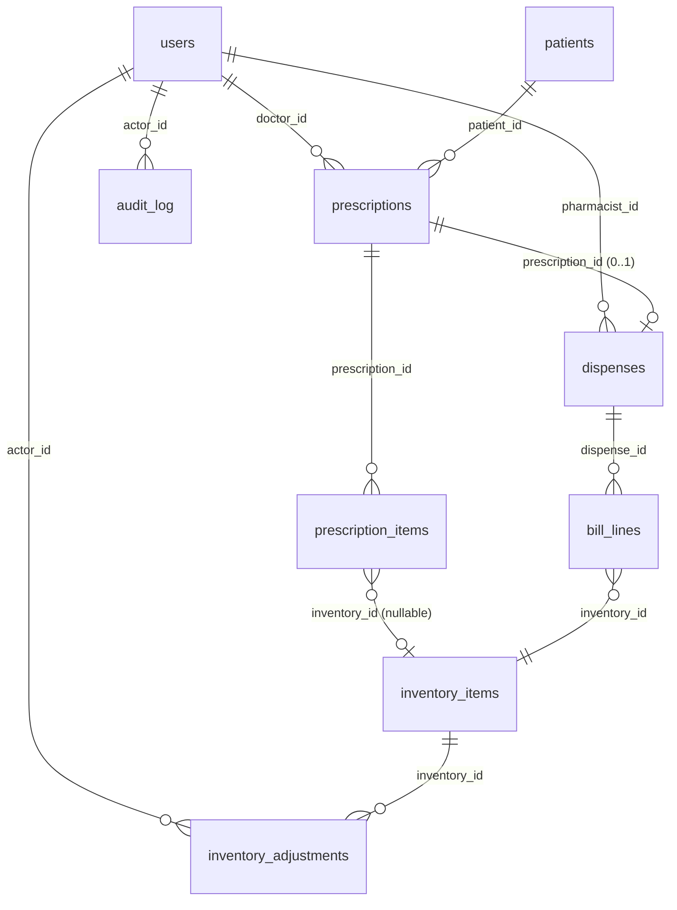

# Data Model: MediCare Clinic Management System (v1)

**Phase 1 output** | Branch: `002-clinic-visit-workflow` | Date: 2026-05-18

All monetary values are stored as **integer paise** (100 paise = ₹1).
All timestamps are **UTC `timestamptz`**; display layer converts to Asia/Kolkata.

---

## Entity Relationship Diagram



---

## Tables

### `public.users`

Mirrors `auth.users`; extended with clinic-specific profile and roles.

| Column | Type | Constraints | Notes |
|---|---|---|---|
| `id` | `uuid` | PK; references `auth.users(id)` | Supabase Auth user ID |
| `display_name` | `text` | NOT NULL | Full name shown in UI |
| `email` | `text` | NOT NULL, UNIQUE | Login email |
| `roles` | `text[]` | NOT NULL; `CHECK (roles <@ ARRAY['doctor','pharmacist','admin'])` | Multi-role support |
| `created_at` | `timestamptz` | DEFAULT `now()` | UTC |

**Validation rules**: At least one role required. Role values are `doctor`, `pharmacist`, `admin` only.
**RLS**: All authenticated roles can read their own row. Admin can read all rows.

---

### `public.patients`

Core PHI table. Treat all columns as sensitive.

| Column | Type | Constraints | Notes |
|---|---|---|---|
| `id` | `uuid` | PK DEFAULT `gen_random_uuid()` | Opaque ID used in all URLs/logs |
| `full_name` | `text` | NOT NULL | PHI — never log |
| `mobile` | `text` | NOT NULL; `CHECK (mobile ~ '^[6-9][0-9]{9}$')` | 10-digit Indian mobile; PHI |
| `gender` | `text` | NOT NULL; `CHECK (gender IN ('M','F','O'))` | |
| `date_of_birth` | `date` | NULLABLE | PHI; preferred over age |
| `age_at_reg` | `smallint` | NULLABLE; `CHECK (age_at_reg BETWEEN 1 AND 120)` | Fallback if DOB unknown |
| `address` | `text` | NOT NULL | PHI |
| `allergies` | `text` | NULLABLE | Free text; surfaced at prescription time |
| `created_by` | `uuid` | REFERENCES `users(id)` | Staff who registered the patient |
| `created_at` | `timestamptz` | DEFAULT `now()` | UTC |
| `deleted_at` | `timestamptz` | NULLABLE | Soft delete; NULL = active |
| **UNIQUE** | | `(full_name, mobile)` | Blocks duplicate registrations |

**Validation rules**: At least one of `date_of_birth` or `age_at_reg` must be present
(enforced at application layer via Zod; DB stores both nullable).
**State**: Active (deleted_at IS NULL) / Soft-deleted (deleted_at IS NOT NULL).
**RLS**: Doctor/Pharmacist/Admin can SELECT active rows. Only Doctor/Admin can INSERT.
Only Admin can UPDATE `deleted_at` (soft delete). No role can hard-DELETE.

---

### `public.prescriptions`

One row per consultation visit.

| Column | Type | Constraints | Notes |
|---|---|---|---|
| `id` | `uuid` | PK DEFAULT `gen_random_uuid()` | |
| `patient_id` | `uuid` | NOT NULL; REFERENCES `patients(id)` | |
| `doctor_id` | `uuid` | NOT NULL; REFERENCES `users(id)` | Prescribing doctor |
| `visit_at` | `timestamptz` | DEFAULT `now()` | UTC; display as IST |
| `symptoms` | `text` | NOT NULL | PHI; max 2000 chars enforced by Zod |
| `vitals` | `jsonb` | NULLABLE | `{sys_bp, dia_bp, pulse, temp_f, weight_kg, height_cm}` — any subset |
| `recommended_tests` | `text[]` | NULLABLE | Free-text rows |
| `doctor_notes` | `text` | NULLABLE | Max 1000 chars enforced by Zod; PHI |
| `status` | `text` | NOT NULL DEFAULT `'PENDING'`; `CHECK (status IN ('PENDING','DISPENSED','CANCELLED'))` | |
| `flagged_edit_after_dispense` | `boolean` | DEFAULT `false` | Set by `edit_dispensed_prescription` edge fn |
| `created_at` | `timestamptz` | DEFAULT `now()` | UTC |
| `updated_at` | `timestamptz` | DEFAULT `now()` | Updated by trigger on any change |

**State machine**:
```
PENDING ──[dispense]──────────────→ DISPENSED
PENDING ──[cancel, doctor/admin]──→ CANCELLED
DISPENSED ──[edit with reason]────→ DISPENSED (flagged_edit_after_dispense = true)
CANCELLED ────────────────────────→ (terminal, no transitions out)
```

**RLS**:
- SELECT: all authenticated roles on non-deleted patient prescriptions.
- INSERT: doctor role only.
- UPDATE status to CANCELLED: doctor (own, PENDING only) or admin.
- UPDATE fields: doctor (own, PENDING = free edit; DISPENSED = via edge fn with reason).
- No DELETE.

---

### `public.prescription_items`

One row per medicine row on a prescription.

| Column | Type | Constraints | Notes |
|---|---|---|---|
| `id` | `uuid` | PK DEFAULT `gen_random_uuid()` | |
| `prescription_id` | `uuid` | NOT NULL; REFERENCES `prescriptions(id)` ON DELETE CASCADE | |
| `inventory_id` | `uuid` | NULLABLE; REFERENCES `inventory_items(id)` | NULL if free-text medicine (not in inventory) |
| `medicine_name` | `text` | NOT NULL | Snapshot at prescribe time; safe to show |
| `dosage` | `text` | NOT NULL | e.g., "500mg" |
| `frequency` | `text` | NOT NULL | e.g., "twice daily", "BD", custom |
| `duration_days` | `smallint` | NULLABLE; `CHECK (duration_days > 0)` | |
| `quantity` | `integer` | NOT NULL; `CHECK (quantity > 0)` | Prescribed quantity |
| `sort_order` | `smallint` | DEFAULT 0 | Display ordering |

**RLS**: Follows parent prescription RLS. Doctor can INSERT/UPDATE/DELETE rows on PENDING prescriptions they own.

---

### `public.inventory_items`

Medicine catalogue with current stock.

| Column | Type | Constraints | Notes |
|---|---|---|---|
| `id` | `uuid` | PK DEFAULT `gen_random_uuid()` | |
| `name` | `text` | NOT NULL | |
| `unit` | `text` | NOT NULL | `tablet`, `strip`, `ml`, `bottle`, `other` |
| `stock_qty` | `integer` | NOT NULL DEFAULT 0; `CHECK (stock_qty >= 0)` | Never negative |
| `min_threshold` | `integer` | NOT NULL DEFAULT 10; `CHECK (min_threshold >= 0)` | Low-stock trigger |
| `unit_price_paise` | `integer` | NOT NULL; `CHECK (unit_price_paise >= 0)` | Integer paise |
| `expiry_date` | `date` | NULLABLE | |
| `batch_no` | `text` | NULLABLE | |
| `created_at` | `timestamptz` | DEFAULT `now()` | UTC |
| `deleted_at` | `timestamptz` | NULLABLE | Soft delete |
| **UNIQUE** | | `(name, batch_no)` | Prevents accidental duplicate entries |

**Computed views**:
- `is_low_stock`: `stock_qty <= min_threshold`
- `is_expiring_soon`: `expiry_date <= CURRENT_DATE + 90`
- `is_expired`: `expiry_date < CURRENT_DATE`

**RLS**:
- SELECT name/stock_qty/expiry: doctor (for autocomplete, excluding `unit_price_paise`).
  Implement via a `inventory_for_doctor` view with column-level GRANT.
- SELECT all columns: pharmacist, admin.
- INSERT: pharmacist, admin.
- UPDATE stock/price/expiry: pharmacist (via `adjust_inventory` edge fn), admin.
- No DELETE (soft-delete via `deleted_at`).

---

### `public.dispenses`

One row per completed dispense action on a prescription.

| Column | Type | Constraints | Notes |
|---|---|---|---|
| `id` | `uuid` | PK DEFAULT `gen_random_uuid()` | |
| `prescription_id` | `uuid` | NOT NULL; UNIQUE; REFERENCES `prescriptions(id)` | One dispense per prescription |
| `pharmacist_id` | `uuid` | NOT NULL; REFERENCES `users(id)` | |
| `dispensed_at` | `timestamptz` | DEFAULT `now()` | UTC |
| `total_paise` | `integer` | NOT NULL; `CHECK (total_paise >= 0)` | Sum of all bill_lines |
| `flagged_edit_after_dispense` | `boolean` | DEFAULT `false` | Set if prescription edited post-dispense |
| `notes` | `text` | NULLABLE | Pharmacist notes |

**RLS**: INSERT via edge fn only (service-role). SELECT: pharmacist, admin.

---

### `public.bill_lines`

One row per medicine dispensed within a dispense action.

| Column | Type | Constraints | Notes |
|---|---|---|---|
| `id` | `uuid` | PK DEFAULT `gen_random_uuid()` | |
| `dispense_id` | `uuid` | NOT NULL; REFERENCES `dispenses(id)` ON DELETE CASCADE | |
| `inventory_id` | `uuid` | NOT NULL; REFERENCES `inventory_items(id)` | |
| `medicine_name` | `text` | NOT NULL | Snapshot at dispense time |
| `qty_dispensed` | `integer` | NOT NULL; `CHECK (qty_dispensed >= 0)` | 0 allowed for "short" lines |
| `decision` | `text` | NOT NULL; `CHECK (decision IN ('dispensed','short','substituted'))` | |
| `substitute_inventory_id` | `uuid` | NULLABLE; REFERENCES `inventory_items(id)` | Populated if decision = 'substituted' |
| `unit_price_paise` | `integer` | NOT NULL; `CHECK (unit_price_paise >= 0)` | Snapshot at dispense time |
| `line_total_paise` | `integer` | GENERATED ALWAYS AS `(qty_dispensed * unit_price_paise)` STORED | |

**RLS**: INSERT via edge fn only. SELECT: pharmacist, admin.

---

### `public.inventory_adjustments`

Append-only log of every stock change (dispense, manual restock, wastage write-off).

| Column | Type | Constraints | Notes |
|---|---|---|---|
| `id` | `uuid` | PK DEFAULT `gen_random_uuid()` | |
| `inventory_id` | `uuid` | NOT NULL; REFERENCES `inventory_items(id)` | |
| `delta_qty` | `integer` | NOT NULL | Negative for consumption/loss; positive for restock |
| `reason` | `text` | NOT NULL | Mandatory for all adjustments |
| `related_dispense_id` | `uuid` | NULLABLE; REFERENCES `dispenses(id)` | Set for dispense-triggered adjustments |
| `actor_id` | `uuid` | NOT NULL; REFERENCES `users(id)` | |
| `created_at` | `timestamptz` | DEFAULT `now()` | UTC |

**RLS**: INSERT via edge fn only. SELECT: pharmacist, admin. No UPDATE, no DELETE.

---

### `audit.audit_log`

Append-only compliance audit trail. Lives in the `audit` schema — separate from `public`.

| Column | Type | Constraints | Notes |
|---|---|---|---|
| `id` | `bigserial` | PK | Sequential for ordering |
| `actor_id` | `uuid` | NULLABLE; REFERENCES `public.users(id)` | NULL if system/trigger action |
| `actor_role` | `text` | NULLABLE | Role at time of action |
| `action` | `text` | NOT NULL | e.g., `prescription.create`, `prescription.edit`, `inventory.adjust`, `patient.soft_delete` |
| `target_table` | `text` | NOT NULL | e.g., `prescriptions`, `inventory_items` |
| `target_id` | `uuid` | NULLABLE | Entity ID affected |
| `before` | `jsonb` | NULLABLE | Row state before mutation |
| `after` | `jsonb` | NULLABLE | Row state after mutation |
| `reason` | `text` | NULLABLE | Required for Dispensed-prescription edits and stock decreases |
| `created_at` | `timestamptz` | DEFAULT `now()` | UTC |

**RLS**: INSERT via edge fn / trigger only (service-role). SELECT: admin only. UPDATE: NONE (enforced by RLS — no policy grants UPDATE). DELETE: NONE.

---

## RLS Policy Summary

| Table | SELECT | INSERT | UPDATE | DELETE |
|---|---|---|---|---|
| `users` | own row (all); all rows (admin) | none (Supabase Auth) | own row (all) | none |
| `patients` | doctor/pharmacist/admin (active only) | doctor/admin | admin (soft delete only) | none |
| `prescriptions` | doctor/pharmacist/admin | doctor | doctor (own); edge fn (status) | none |
| `prescription_items` | follows prescriptions | doctor | doctor (PENDING rx own) | doctor (PENDING rx own) |
| `inventory_items` | doctor (limited view); pharmacist/admin (full) | pharmacist/admin | edge fn only | none |
| `dispenses` | pharmacist/admin | edge fn only | none | none |
| `bill_lines` | pharmacist/admin | edge fn only | none | none |
| `inventory_adjustments` | pharmacist/admin | edge fn only | none | none |
| `audit.audit_log` | admin | edge fn / trigger only | none | none |

Helper function in DB migrations:
```sql
create or replace function current_user_roles()
returns text[] language sql stable security definer as $$
  select coalesce(
    (auth.jwt() -> 'user_metadata' ->> 'roles')::text[],
    array[]::text[]
  );
$$;
```

---

## Zod Schema Alignment

Each entity above maps to a Zod schema in `src/lib/zod-schemas/`. Key schemas:

```typescript
// src/lib/zod-schemas/patient.ts
export const PatientCreateSchema = z.object({
  full_name: z.string().min(2).max(200),
  mobile: z.string().regex(/^[6-9][0-9]{9}$/, 'Invalid Indian mobile'),
  gender: z.enum(['M', 'F', 'O']),
  date_of_birth: z.string().date().optional(),
  age_at_reg: z.number().int().min(1).max(120).optional(),
  address: z.string().min(1).max(500),
  allergies: z.string().max(1000).optional(),
}).refine(d => d.date_of_birth || d.age_at_reg, {
  message: 'Either date_of_birth or age_at_reg is required',
});

// src/lib/zod-schemas/prescription.ts
export const VitalsSchema = z.object({
  sys_bp: z.number().int().positive().optional(),
  dia_bp: z.number().int().positive().optional(),
  pulse: z.number().int().positive().optional(),
  temp_f: z.number().positive().optional(),
  weight_kg: z.number().positive().optional(),
  height_cm: z.number().positive().optional(),
}).optional();

export const PrescriptionItemSchema = z.object({
  inventory_id: z.string().uuid().optional(),
  medicine_name: z.string().min(1),
  dosage: z.string().min(1),
  frequency: z.string().min(1),
  duration_days: z.number().int().positive().optional(),
  quantity: z.number().int().positive(),
});

export const PrescriptionCreateSchema = z.object({
  patient_id: z.string().uuid(),
  symptoms: z.string().min(1).max(2000),
  vitals: VitalsSchema,
  items: z.array(PrescriptionItemSchema).min(1),
  recommended_tests: z.array(z.string()).optional(),
  doctor_notes: z.string().max(1000).optional(),
});

// src/lib/zod-schemas/dispense.ts
export const BillLineInputSchema = z.object({
  inventory_id: z.string().uuid(),
  qty: z.number().int().min(0),
  decision: z.enum(['dispensed', 'short', 'substituted']),
  substitute_inventory_id: z.string().uuid().optional(),
});

export const DispenseInputSchema = z.object({
  prescription_id: z.string().uuid(),
  lines: z.array(BillLineInputSchema).min(1),
  notes: z.string().max(500).optional(),
});

// src/lib/zod-schemas/inventory.ts
export const InventoryItemSchema = z.object({
  name: z.string().min(1).max(200),
  unit: z.enum(['tablet', 'strip', 'ml', 'bottle', 'other']),
  stock_qty: z.number().int().min(0),
  min_threshold: z.number().int().min(0),
  unit_price_paise: z.number().int().min(0),
  expiry_date: z.string().date().optional(),
  batch_no: z.string().max(100).optional(),
});

export const InventoryAdjustSchema = z.object({
  inventory_id: z.string().uuid(),
  delta_qty: z.number().int(),
  reason: z.string().min(1).max(500),
});
```